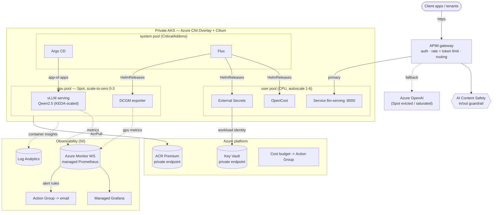

# azure-llmops — LLM serving platform on AKS (GitOps + Observability + FinOps)

Terraform that stands up, from nothing, a reusable **LLM-serving platform on Azure
AKS**: a private cluster with a Spot GPU pool that scales to zero, **both Argo CD
and Flux** for GitOps delivery, managed Prometheus/Grafana observability, FinOps
guardrails (OpenCost + Azure budgets), and a top-tier open-weight model served behind
**API Management** with **Content Safety**.

Built to the Near.U LLMOps/MLOps JD ([jd.md](jd.md)). Conventions (layered Terraform,
decision tables, cost estimate, pre-commit, kind e2e, TDD) follow the patterns in the
sibling `miniclip/` and `sap2026/T3-2/` projects.

## Architecture



## Layered Terraform

Split **by layer**, not by resource type. Each numbered directory is its own root
module with its own state; layers communicate via `terraform_remote_state` outputs —
the same standard as `miniclip/`. A network change re-plans in seconds without touching
AKS.

| Layer | Owns | Reads (remote state) |
|---|---|---|
| `00-bootstrap` | Remote-state Storage Account + container, platform/network/observability RGs, naming + tag schema | — |
| `10-network` | VNet, subnets (system/user/gpu/apim/pe), NSGs, private DNS zones | `00` |
| `20-identity` | Key Vault, ACR (both private-endpoint'd), user-assigned identities, KV/ACR RBAC | `00 / 10` |
| `30-aks` | Private AKS, system/CPU/GPU(Spot, scale-to-zero) pools, KEDA+VPA, OIDC federation, Log Analytics + Azure Monitor workspace | `00 / 10 / 20` |
| `40-gitops` | **Argo CD + Flux** via Helm; app-of-apps (Argo) + GitRepository/Kustomization (Flux) | `00 / 20 / 30` |
| `50-observability` | Managed Grafana, Prometheus alert/recording rules, Action Group, AKS diagnostics, **Azure budget** | `00 / 30` |
| `60-llm-platform` | APIM (gateway + token-limit policy), AI Content Safety, optional Azure OpenAI fallback, KV secrets | `00 / 10 / 20` |

### Apply order — `00 → 10 → 20 → 30 → 40 → 50 → 60`

```sh
cp terraform.tfvars.example terraform.tfvars   # then edit
az login && az account set --subscription <sub>

# 00-bootstrap creates the state Storage Account on a LOCAL backend, then:
terraform -chdir=terraform/00-bootstrap init
terraform -chdir=terraform/00-bootstrap apply -var-file="$PWD/terraform.tfvars"
terraform -chdir=terraform/00-bootstrap init -migrate-state   # push state into the bucket

# everything else (helper handles per-layer backend-config + key):
scripts/apply.sh 10-network 20-identity 30-aks 40-gitops 50-observability 60-llm-platform
```

A second `terraform plan` in any layer should be **clean (no diff)** — the composition
is idempotent.

> **Private-cluster note.** `30-aks` builds a *private* API server. `40-gitops` and the
> `60` Key Vault secret writes must run from **inside the VNet** (self-hosted CI agent /
> jumpbox / `az aks command invoke`) and need `kubelogin`. This is the one deliberate
> "manual placement" caveat, called out rather than hidden (cf. miniclip's SNS-confirm).

## GitOps — why both Argo CD and Flux

| Tool | Owns | Why |
|---|---|---|
| **Flux** | Platform/infrastructure HelmReleases — External Secrets, OpenCost, DCGM exporter, GPU operator/KAITO | HelmRelease/HelmRepository model + drift correction fit long-lived, dependency-ordered infra. |
| **Argo CD** | Product apps — the LLM serving stack via **app-of-apps** | Rich UI, sync waves, and per-app RBAC fit application delivery and on-call ergonomics. |

Running both **separates platform from product** reconciliation and blast radius. For a
single-tool production standard I'd consolidate on **Flux** (simpler multi-tenancy, no
extra control-plane to run) *or* **Argo CD** (if the UI/SSO story matters more) — and
say so in review rather than carry two controllers forever. The LLM stack is declared in
[`gitops/`](gitops/) and reconciled from Git — never `kubectl apply`.

## LLM serving ("top 1")

[`gitops/apps/llm`](gitops/apps/llm) serves **Qwen2.5-Instruct** (7B dev / 72B prod) via
**vLLM** (OpenAI-compatible) on the GPU Spot pool. vLLM chosen for continuous batching +
PagedAttention throughput and a drop-in OpenAI API; **KAITO** is the Azure-native
alternative (its operator + GPU provisioner install via Flux). KEDA scales replicas on
inflight concurrency to **zero**, the cluster autoscaler then removes the GPU node.

## Observability

Managed Prometheus (Azure Monitor workspace) + managed Grafana. DCGM exports per-GPU
metrics; vLLM exports token throughput + latency histograms. Prometheus rule groups in
[`50-observability/alerts.tf`](terraform/50-observability/alerts.tf) cover `GPUSaturated`,
`LLMLatencyHigh`, and `GPUIdleButProvisioned` (catches broken scale-to-zero), all routed
to one ops Action Group. OpenCost provides the cost/token allocation feeding Grafana.

## FinOps

- **GPU Spot pool + scale-to-zero** (`gpu_node_min_count = 0`) — the single biggest lever.
- **KEDA** scales serving to 0 replicas; cluster autoscaler drains the GPU node.
- **OpenCost** for namespace/tenant cost allocation; **Azure budget** (80% actual / 100%
  forecast) on the platform RG.
- Enforced **cost-allocation tags** (`environment/product/cost_center/owner`) on every
  resource via `local.tags`.
- ACR + Log Analytics retention capped; APIM `llm-token-limit` meters tokens per tenant.

### Guaranteed GPU fleet (e.g. 6× H100)

The GPU pool is parameterized — flip the default Spot/scale-to-zero pool to a guaranteed
fleet via tfvars (no module edits):

| Want | Set |
|---|---|
| 6× H100 (6 replicas, 1 GPU each) | `gpu_node_vm_size=Standard_NC40ads_H100_v5`, `gpu_node_priority=Regular`, `gpu_node_min_count=gpu_node_max_count=6` |
| 6× H100 (3 nodes × 2 GPU, TP=2) | `Standard_NC80adis_H100_v5`, `min=max=3` + uncomment the tensor-parallel patch in the prod overlay |

Azure has **no 6-GPU SKU** — "6 H100" = node_count × GPUs/node. Prereqs, in order:
**(1) quota** for the `NCADS_H100_v5` family (6× NC40 = 240 vCPU) raised via support;
**(2) a region** that actually offers it (`az vm list-skus`); **(3) `Regular` priority**
— Spot won't reliably hold 6 H100; pin with a Capacity Reservation
(`gpu_capacity_reservation_group_id`) for guaranteed stock. H100 SKUs are often
single-zone, hence `gpu_node_zones=["1"]`. Driver: the default **AKS-managed** path works
for H100; for a pinned driver or **MIG** partitioning, enable the opt-in NVIDIA GPU
Operator ([gitops/infrastructure/gpu-operator.yaml](gitops/infrastructure/gpu-operator.yaml)).
Cost reality: 6× NC40ads_H100_v5 on-demand 24×7 ≈ **$28–30k/mo** — scale-to-zero no longer
applies, so the levers become **MIG**, **Capacity/1-yr Reservations**, and FP8/AWQ
quantization to fit larger models on fewer GPUs.

## Decision justification

| Decision | Rationale |
|---|---|
| Layered TF, one state per layer | Re-plan a layer without reading those above; mirrors the apply graph (miniclip standard). |
| 00-bootstrap on local backend, then migrate | Chicken-and-egg: the layer that creates the state Storage Account can't already store state in it. |
| Azure CNI **Overlay + Cilium** | Overlay keeps pod IPs off the VNet (scales without subnet exhaustion); Cilium gives eBPF NetworkPolicy enforcement (which kind cannot reproduce). |
| **Private** AKS + Key Vault/ACR private endpoints | No public control-plane or data-plane surface; JD weights security. Cost: GitOps bootstrap must run in-VNet. |
| GPU pool = **Spot + scale-to-zero**, taint `sku=gpu` | ~60-90% cheaper than on-demand; idle GPU is the dominant waste. Taint keeps non-GPU pods off A100s. |
| `spot_max_price = -1` | Never evicted on price alone (only on capacity); avoids surprise mid-request kills. |
| **Workload Identity** (federated), no stored secrets | Pods get Azure tokens via OIDC; nothing to leak in Git/state. Federation lives in `30` because the OIDC issuer only exists post-cluster. |
| KEDA + cluster autoscaler (not HPA alone) | Scale serving to **zero** on idle and back on queue depth — HPA floors at 1. |
| Managed Prometheus/Grafana (not self-hosted) | No Prometheus HA/retention to operate; AKS wires DCR/DCRA automatically via `monitor_metrics`. |
| **vLLM** for serving, KAITO as alt | Continuous batching + OpenAI API out of the box; KAITO is the Azure-native operator path (documented). |
| **APIM** in front of the model | One audited entrypoint for auth, per-tenant rate + **token** limits, and routing — the FinOps/governance edge. |
| **Azure OpenAI fallback** | Spot eviction or saturation → fail over to pay-go managed model; no GPU floor for the hedge. |
| Both Argo CD **and** Flux | Separate product (Argo) from platform (Flux) reconciliation; see table above. |
| Budget + low-threshold alerts | Catch a runaway GPU bill early (cf. miniclip's deliberately-low billing alarm). |

## Monthly cost estimate (West Europe, 30-day month, steady state)

Assumes the GPU pool runs ~8h/day (scale-to-zero overnight/weekends), 1× A100 80GB.

| Item | Qty | Basis | Monthly |
|---|---|---|---|
| GPU `NC24ads_A100_v4` **Spot**, ~8h/day | 1 | ~$1.20/h Spot × ~240h | **~$290** |
| System pool `D4s_v5` | 2 | $0.19/h × 730h | $277 |
| User pool `D4s_v5` (autoscale, ~1.5 avg) | ~1.5 | $0.19/h × 730h | $208 |
| AKS uptime SLA (Standard tier) | 1 | $0.10/h × 730h | $73 |
| Managed Prometheus (AMW) | — | ~10 GB samples | ~$30 |
| Managed Grafana | 1 | Standard | $9 |
| Log Analytics ingest | ~10 GB | $2.76/GB (30d) | ~$28 |
| ACR Premium | 1 | $1.667/day × 30 | $50 |
| APIM **Developer** (non-prod) | 1 | $0.07/h × 730h | $51 |
| Key Vault + private endpoints (2) | — | ops + $0.01/h × 2 | ~$16 |
| Content Safety (S0) | — | low volume | ~$5 |
| **Total (steady state, Spot 8h/day)** | | | **~$1,035/mo** |

Levers: GPU is the elastic cost — 24×7 on-demand A100 alone is **~$2,700/mo**, so Spot +
scale-to-zero is the headline saving. **Premium APIM** (VNet/prod) replaces Developer at
**~$2,800/mo** — the biggest prod step-up; use Standard v2 + private endpoints if full
VNet injection isn't required. Cheaper dev variant: smaller GPU (`NC4as_T4_v3`, ~$0.20/h
Spot) and `Developer` APIM → well under **$500/mo**.

## Quality gates

- **pre-commit** (`pre-commit install`): terraform fmt/validate/tflint/docs, checkov
  (soft-fail), yamllint, shellcheck, detect-secrets.
- **CI** — [`lint.yml`](.github/workflows/lint.yml) (fmt + per-layer validate + tflint +
  checkov) and [`e2e.yml`](.github/workflows/e2e.yml) (kind GitOps logic test).
- **e2e** ([`test/run-test.sh`](test/run-test.sh)): all overlays build, base applies on
  kind, Service gets endpoints, **zero-downtime** rolling update, PDB present. What kind
  can't cover (GPU, Spot, managed Prometheus/Grafana, APIM) gates on a prod-like AKS run
  — see [BONUS.md](BONUS.md).

See [CHANGES.md](CHANGES.md) for what was built and trade-offs, and [BONUS.md](BONUS.md)
for the longevity / cost-bounding / HA-testing answers.
