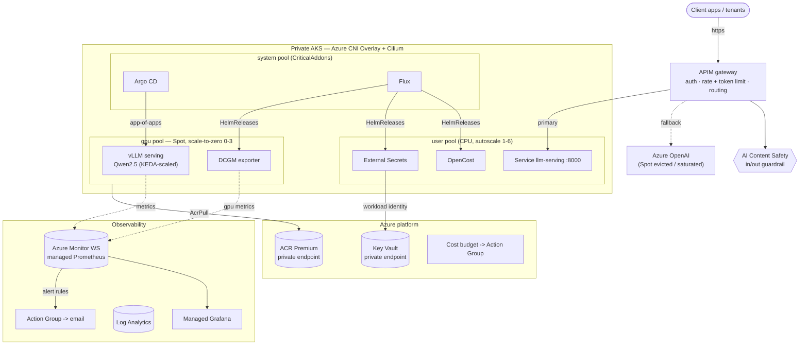

<!--
  Publish-ready README for the PUBLIC repo  adminless-io/aks-llm-platform
  (reframed from the internal azure-llmops/README.md for an external audience).
  Replace adminless-io/aks-llm-platform and the Dev.to article links before publishing.
-->

# aks-llm-platform

> **Self-hosted LLM inference on Azure AKS, built entirely with Terraform + GitOps.**
> A private AKS cluster with a Spot GPU pool that **scales to zero**, GitOps delivery
> (Argo CD **and** Flux), managed Prometheus/Grafana, FinOps guardrails, and an
> open-weight model served behind **API Management** with **Content Safety**.

<p>
  
  
  
  
  
  
</p>

---

## TL;DR

`terraform apply` (in layer order) stands up — from nothing — a **reusable LLM-serving
platform on Azure AKS**:

- 🔒 **Private** AKS (Azure CNI Overlay + Cilium), private Key Vault & ACR endpoints — no public data/control plane.
- 💸 **Spot GPU pool, scale-to-zero (0→3)** — idle GPUs are the dominant cost; KEDA scales serving replicas to **zero** on idle, the cluster autoscaler then drains the GPU node.
- 🚀 **vLLM** (OpenAI-compatible, continuous batching + PagedAttention) serving **Qwen2.5-Instruct** (7B dev / 72B prod); **KAITO** documented as the Azure-native alternative.
- 🔁 **GitOps with both Argo CD and Flux** — product apps vs platform infra, separated by blast radius.
- 📊 **Managed Prometheus + Grafana**, DCGM per-GPU metrics, vLLM token/latency histograms, alert rules that even catch a *broken* scale-to-zero.
- 🛡️ **APIM gateway** — per-tenant auth, **rate + token limits**, routing, **AI Content Safety** in/out guardrail, Azure OpenAI **fallback** on Spot eviction.
- 🧱 **Layered Terraform** — one state per layer; re-plan the network without touching AKS.

> **Cost anchor:** ~**$1,035/mo** steady state (Spot A100, ~8h/day) vs ~**$2,700/mo** for a 24×7 on-demand A100 — Spot + scale-to-zero is the headline lever. A cheaper dev variant (T4 Spot + Developer APIM) runs **under $500/mo**.

---

## Use this template

This repo is a **GitHub template** — click **“Use this template”** (or use the CLI), then run the
initializer. It rewrites placeholders, points GitOps at *your* new repo, and seeds `terraform.tfvars`.

```sh
gh repo create my-org/my-llm-platform \
  --template adminless-io/aks-llm-platform --private --clone
cd my-llm-platform
scripts/init-template.sh            # interactive: name_prefix, region, email, GitOps URL…
# then set subscription_id + tenant_id in terraform.tfvars and follow the Quickstart
```

On the first push, [`template-cleanup.yml`](.github/workflows/template-cleanup.yml) also scrubs
placeholders automatically and deletes itself. Maintainer setup (marking the repo as a template,
topics) lives in [USE_AS_TEMPLATE.md](USE_AS_TEMPLATE.md).

---

## Why this exists

Most "LLM on Kubernetes" guides stop at `kubectl apply` of a vLLM Deployment on someone's
laptop cluster — or cover **one pillar** (just serving, just autoscaling, just IaC) on GKE/EKS.
This repo is the **end-to-end, AKS-native** version, reconciled from Git and reproducible from
a clean subscription: networking, identity, the GPU cluster, GitOps, observability, FinOps, and
the governance edge — as one composable Terraform graph.

It's also the reference implementation behind a Dev.to article series (see [Writeups](#writeups)).

---

## Architecture



---

## Layered Terraform

Split **by layer**, not by resource type. Each numbered directory is its own root module
with its own state; layers communicate via `terraform_remote_state` outputs. A network
change re-plans in seconds without touching AKS.

| Layer | Owns | Reads |
|---|---|---|
| [`00-bootstrap`](terraform/00-bootstrap) | Remote-state Storage Account + container, resource groups, naming + tag schema | — |
| [`10-network`](terraform/10-network) | VNet, subnets (system/user/gpu/apim/pe), NSGs, private DNS zones | `00` |
| [`20-identity`](terraform/20-identity) | Key Vault, ACR (both private-endpoint'd), user-assigned identities, RBAC | `00 / 10` |
| [`30-aks`](terraform/30-aks) | Private AKS, system/CPU/GPU(Spot, scale-to-zero) pools, KEDA + VPA, OIDC federation, Log Analytics + Azure Monitor workspace | `00 / 10 / 20` |
| [`40-gitops`](terraform/40-gitops) | **Argo CD + Flux** via Helm; app-of-apps (Argo) + GitRepository/Kustomization (Flux) | `00 / 20 / 30` |
| [`50-observability`](terraform/50-observability) | Managed Grafana, Prometheus alert/recording rules, Action Group, AKS diagnostics, **Azure budget** | `00 / 30` |
| [`60-llm-platform`](terraform/60-llm-platform) | APIM (gateway + token-limit policy), AI Content Safety, optional Azure OpenAI fallback, KV secrets | `00 / 10 / 20` |

---

## Quickstart

> **Prerequisites:** Azure subscription + `az login`, Terraform ≥ 1.6, `kubectl`, `kubelogin`.
> Apply order is strict: `00 → 10 → 20 → 30 → 40 → 50 → 60`.

```sh
cp terraform.tfvars.example terraform.tfvars     # then edit
az login && az account set --subscription <sub>

# 00-bootstrap creates the state Storage Account on a LOCAL backend, then migrates:
terraform -chdir=terraform/00-bootstrap init
terraform -chdir=terraform/00-bootstrap apply -var-file="$PWD/terraform.tfvars"
terraform -chdir=terraform/00-bootstrap init -migrate-state

# everything else (helper handles per-layer backend-config + state key):
scripts/apply.sh 10-network 20-identity 30-aks 40-gitops 50-observability 60-llm-platform
```

A second `terraform plan` in any layer is **clean (no diff)** — the composition is idempotent.
Tear down with `scripts/destroy.sh` (reverse order).

> ⚠️ **Private-cluster note.** `30-aks` builds a *private* API server, so `40-gitops` and the
> `60` Key Vault secret writes must run **from inside the VNet** (self-hosted CI agent / jumpbox
> / `az aks command invoke`). This is the one deliberate manual-placement caveat — documented, not hidden.

---

## Scale-to-zero, concretely

The FinOps centerpiece needs **no custom GPU external scaler**: vLLM already exports the right
signal, so KEDA scales on a Prometheus metric and the cluster autoscaler removes the Spot node.

```yaml
# gitops/apps/llm/base/scaledobject.yaml
spec:
  scaleTargetRef: { name: llm-serving }
  minReplicaCount: 0          # <- enables scale-to-zero
  maxReplicaCount: 3
  cooldownPeriod: 300
  triggers:
    - type: prometheus
      metadata:
        metricName: vllm_num_requests_running
        query: sum(vllm_num_requests_running)
        threshold: "4"
```

When inflight requests drop to 0, KEDA scales serving to **0 replicas** → the GPU node empties →
the cluster autoscaler removes it. The `GPUIdleButProvisioned` Prometheus rule alerts if a node
is ever held with no work (i.e. scale-to-zero silently broke).

---

## Repository layout

```
aks-llm-platform/
├── terraform/                 # layered IaC, one state per layer
│   ├── 00-bootstrap/          # remote state, RGs, naming/tags
│   ├── 10-network/            # VNet, subnets, NSGs, private DNS
│   ├── 20-identity/           # Key Vault, ACR, UAMIs, RBAC, private endpoints
│   ├── 30-aks/                # private AKS, node pools, KEDA/VPA, OIDC federation, monitoring
│   ├── 40-gitops/             # Argo CD + Flux (Helm)
│   ├── 50-observability/      # Grafana, alert/recording rules, Action Group, Azure budget
│   └── 60-llm-platform/       # APIM, Content Safety, Azure OpenAI fallback, secrets
├── gitops/
│   ├── apps/llm/              # vLLM serving: base + dev/prod overlays (Kustomize) + KEDA ScaledObject
│   ├── argocd/                # app-of-apps for the product stack
│   └── infrastructure/        # Flux HelmReleases: External Secrets, OpenCost, DCGM, GPU operator
├── scripts/                   # apply.sh / destroy.sh + init-template.sh
├── test/                      # kind-based GitOps e2e (run-test.sh)
└── terraform.tfvars.example
```

---

## GitOps — why both Argo CD and Flux

| Tool | Owns | Why |
|---|---|---|
| **Flux** | Platform/infra HelmReleases — External Secrets, OpenCost, DCGM, GPU operator | HelmRelease model + drift correction fit long-lived, dependency-ordered infra. |
| **Argo CD** | Product apps — the LLM serving stack via **app-of-apps** | Rich UI, sync waves, per-app RBAC fit application delivery and on-call ergonomics. |

Running both **separates platform from product** reconciliation and blast radius. For a single-tool
production standard you'd consolidate on **Flux** (simpler multi-tenancy) *or* **Argo CD** (if UI/SSO
matters more) — and say so in review rather than carry two controllers forever.

---

## FinOps

- **GPU Spot pool + scale-to-zero** (`gpu_node_min_count = 0`) — the single biggest lever.
- **KEDA** scales serving to 0; cluster autoscaler drains the GPU node.
- **OpenCost** for namespace/tenant cost allocation; **Azure budget** (80% actual / 100% forecast).
- Enforced **cost-allocation tags** (`environment/product/cost_center/owner`) on every resource.
- ACR + Log Analytics retention capped; APIM `llm-token-limit` meters tokens per tenant.

<details>
<summary><b>Monthly cost estimate (West Europe, Spot A100 ~8h/day)</b></summary>

| Item | Qty | Monthly |
|---|---|---|
| GPU `NC24ads_A100_v4` **Spot**, ~8h/day | 1 | ~$290 |
| System pool `D4s_v5` | 2 | $277 |
| User pool `D4s_v5` (autoscale ~1.5) | ~1.5 | $208 |
| AKS uptime SLA (Standard) | 1 | $73 |
| Managed Prometheus + Grafana | — | ~$39 |
| Log Analytics ingest (~10 GB) | — | ~$28 |
| ACR Premium | 1 | $50 |
| APIM **Developer** (non-prod) | 1 | $51 |
| Key Vault + private endpoints, Content Safety | — | ~$21 |
| **Total** | | **~$1,035/mo** |

24×7 on-demand A100 alone ≈ **$2,700/mo**; **Premium APIM** (prod/VNet) adds ~$2,800/mo.
Dev variant (T4 Spot + Developer APIM) → under **$500/mo**.
</details>

<details>
<summary><b>Scaling to a guaranteed GPU fleet (e.g. 6× H100)</b></summary>

The GPU pool is parameterized — flip Spot/scale-to-zero to a guaranteed fleet via tfvars, no module edits:

| Want | Set |
|---|---|
| 6× H100 (6 replicas, 1 GPU each) | `gpu_node_vm_size=Standard_NC40ads_H100_v5`, `gpu_node_priority=Regular`, `gpu_node_min_count=gpu_node_max_count=6` |
| 6× H100 (3 nodes × 2 GPU, TP=2) | `Standard_NC80adis_H100_v5`, `min=max=3` + tensor-parallel patch in the prod overlay |

Azure has **no 6-GPU SKU** — "6 H100" = nodes × GPUs/node. Prereqs: (1) **quota** for `NCADS_H100_v5`,
(2) a **region** that offers it, (3) **`Regular` priority** (+ Capacity Reservation for guaranteed stock).
6× NC40ads_H100_v5 on-demand 24×7 ≈ **$28–30k/mo** — scale-to-zero no longer applies, so the levers
become **MIG**, **Reservations**, and FP8/AWQ quantization.
</details>

---

## Quality gates

- **pre-commit** — terraform fmt/validate/tflint/docs, checkov (soft-fail), yamllint, shellcheck, detect-secrets.
- **CI** — [`lint.yml`](.github/workflows/lint.yml) (fmt + per-layer validate + tflint + checkov), [`e2e.yml`](.github/workflows/e2e.yml) (kind GitOps logic test).
- **e2e** ([`test/run-test.sh`](test/run-test.sh)) — all overlays build, base applies on kind, Service gets endpoints, **zero-downtime** rolling update, PDB present.

---

## Writeups

Deep-dives on the design decisions behind this repo:

- **Self-Hosted LLM on Azure AKS at Scale: Terraform → vLLM → KEDA → APIM** — _(coming soon)_
- **GPU Scale-to-Zero for LLM Inference on AKS — Without a Custom KEDA External Scaler** — _(coming soon)_
- **Argo CD and Flux Together on AKS: Separating Platform from Product** — _(coming soon)_
- **Putting Azure API Management in Front of Self-Hosted LLMs** — _(coming soon)_

---

## Roadmap / non-goals

- ✅ Reproducible from a clean subscription; idempotent re-plan; kind e2e for GitOps logic.
- 🔜 Self-hosted in-VNet CI runner for the private-cluster bootstrap step.
- 🔜 KAITO path as a first-class alternative to the hand-rolled vLLM Deployment.
- 🚫 Not a managed SaaS, not a fine-tuning pipeline — this is the **serving + ops** layer.

---

## Contributing

Issues and PRs welcome. Run `pre-commit install` before committing; CI mirrors the same gates.

## License

MIT — see [LICENSE](LICENSE).
